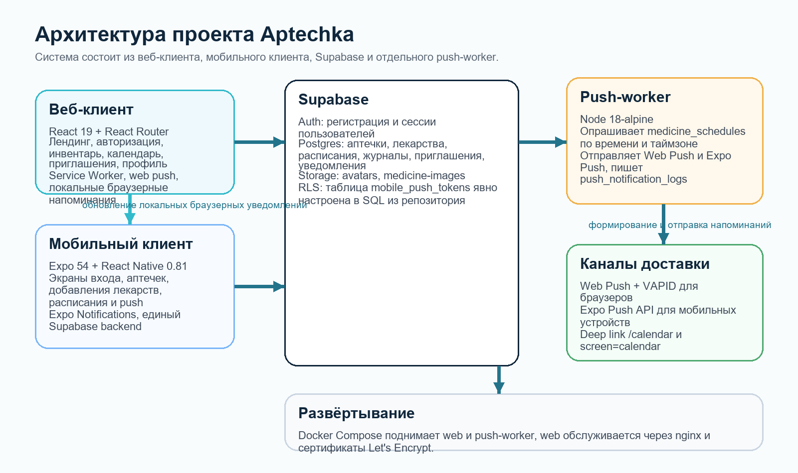

<div align="center">
  

# Aptecka

### Цифровая аптечка с веб-клиентом, мобильным приложением и системой напоминаний

`Aptecka` объединяет сайт, мобильное приложение и общий backend, чтобы хранить лекарства, вести расписание приема и отправлять напоминания в нужный момент.

<p>
  
  
  
  
  
</p>

<p>
  <a href="#архитектура">Архитектура</a> •
  <a href="#что-внутри">Что внутри</a> •
  <a href="#быстрый-старт">Быстрый старт</a> •
  <a href="#структура-репозитория">Структура</a> •
  <a href="#документация">Документация</a>
</p>
</div>

---

## Что это за проект

`Aptecka` помогает собрать в одном месте:

- список лекарств и аптечек;
- расписание приема и напоминания;
- веб-интерфейс для браузера;
- мобильный клиент для Android на Expo;
- общий Supabase backend для авторизации, данных и storage.

Проект оформлен как монорепозиторий, чтобы веб и мобильная версия развивались рядом, но не мешали друг другу.

## Архитектура



## Что внутри

| Модуль | Назначение | Ключевые возможности |
| --- | --- | --- |
| `web/` | Веб-приложение на React | лендинг, авторизация, инвентарь, календарь, профиль, browser push |
| `mobile/` | Мобильный клиент на Expo / React Native | авторизация, аптечки, добавление лекарств, календарь, push-подготовка |
| `Supabase` | Общий backend | auth, Postgres, storage, SQL-логика, единые данные для двух клиентов |
| `push-worker` | Сервер отправки напоминаний | планирование и отправка web push и mobile push событий |
| `docs/` | Документация проекта | техдок, схемы, материалы для защиты |

## Что уже реализовано

- [x] Единая авторизация и backend для web и mobile
- [x] Работа с аптечками, лекарствами и расписаниями
- [x] Календарный сценарий использования
- [x] Web Push напоминания для браузера
- [x] Базовая мобильная архитектура на Expo
- [x] Docker-конфигурация для веб-развертывания

## Быстрый старт

### 1. Web

```bash
cd web
npm install
npm start
```

### 2. Mobile

```bash
cd mobile
npm install
npm start
```

### 3. Переменные окружения

| Клиент | Файл | Что важно указать |
| --- | --- | --- |
| Web | `web/.env` | ключи Supabase, VAPID и настройки push |
| Mobile | `mobile/.env` | `EXPO_PUBLIC_SUPABASE_URL`, `EXPO_PUBLIC_SUPABASE_ANON_KEY` |

## Технологии

| Зона | Стек |
| --- | --- |
| Frontend Web | React 19, React Router, CSS, Service Worker |
| Frontend Mobile | Expo 54, React Native 0.81, Expo Notifications |
| Backend | Supabase Auth, Supabase Postgres, Supabase Storage |
| Infra | Docker, docker-compose, nginx |
| Notifications | Web Push, VAPID, push worker |

## Структура репозитория

```text
Aptecka/
├── web/      # React web client
├── mobile/   # Expo / React Native client
├── docs/     # technical documentation and assets
├── README.md
└── .gitignore
```

## Документация

- Веб-клиент: [web/README.md](web/README.md)
- Мобильный клиент: [mobile/README.md](mobile/README.md)
- Техническая документация: [docs/techdoc](docs/techdoc)

## Почему такой формат удобен

Один репозиторий дает общую картину проекта: можно одновременно развивать сайт, мобильное приложение и документацию, не теряя связи между экранами, backend-логикой и напоминаниями. При этом `web/` и `mobile/` остаются независимыми приложениями со своими командами запуска и настройками.
